# Setting up Google Drive access for `dsync`

`dsync` talks to Google Drive with an OAuth client that **you** create in your own Google Cloud
project. Nothing is baked into the binary, no quota is shared with anyone else, and you can revoke
access at any time from your Google account. This walkthrough takes about ten minutes and uses a
regular `@gmail.com` account (a Google Workspace account works the same way, with one shortcut noted
in step 3).

You'll need `dsync` installed (see the [README](../README.md#install)) and a browser signed in to the
Google account whose Drive you want to sync.

## 1. Create a Cloud project and enable the Drive API

The quickest way is Google's one-page flow, which creates a project and enables the API together:

<https://console.cloud.google.com/flows/enableapi?apiid=drive.googleapis.com>

If this is your first visit to the Cloud Console, accept the terms of service first; no billing
account is needed. In the flow, pick **Create a project**, give it any name (the screenshots use
*Test-Cloud-Project*), and click **Next**, then **Enable**.

To do the same by hand instead: open the [Cloud Console](https://console.cloud.google.com/), use
the project picker at the top to create and select a project, then go to
**APIs & Services → Library**, search for *Google Drive API*, open it and click **Enable**.

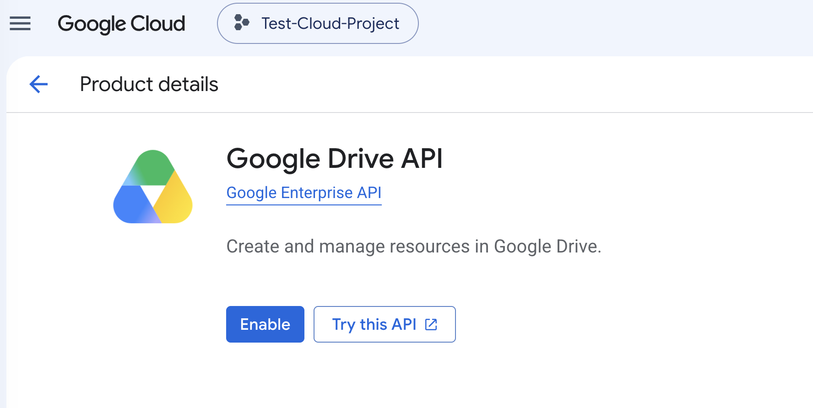

## 2. Set up the consent screen (branding)

Go to **Google Auth Platform** (search for it in the top bar, or **APIs & Services → OAuth consent
screen**). The first visit shows a short *Get started* wizard:

1. **App name**: what you'll see on Google's sign-in screens, e.g. *DriveSync Personal App*.
2. **User support email**: your address.
3. **Audience**: choose **External** (see step 3).
4. **Contact information**: your address again.

The full **Branding** page also has optional fields for a logo, home page, privacy policy, terms of
service and authorised domains. You can leave all of those empty for personal use; they only matter
if you intend to submit the app for Google's verification.

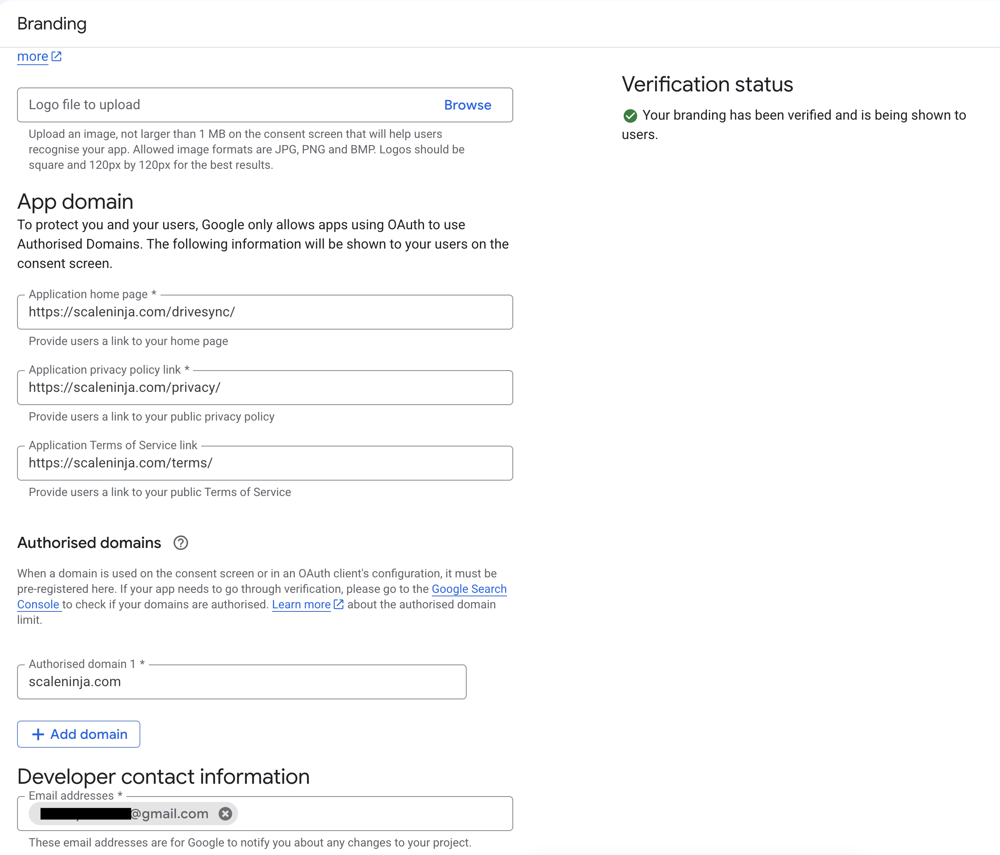

## 3. Audience: add yourself as a test user, then decide whether to publish

Open **Audience** in the left menu. A new app starts in **Testing** with user type **External**.
Under **Test users**, click **Add users** and add the Google account you'll sync with. Only listed
test users can sign in while the app is in Testing.

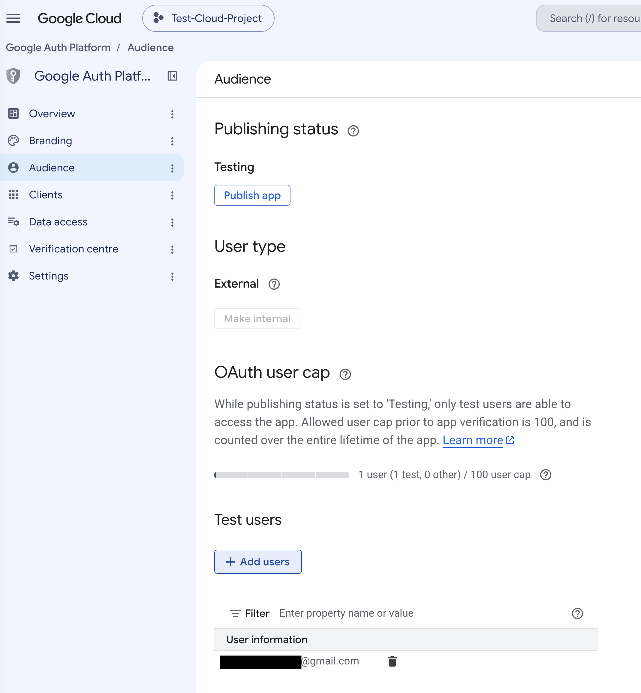

Now pick one of two modes. Both work with `dsync`; they differ in what Google shows at sign-in and
how long the login lasts.

| | Stay in **Testing** | Click **Publish app** |
|---|---|---|
| Who can sign in | Only listed test users | Anyone with the client JSON |
| Sign-in screens | "App is being tested" notice, then consent | Red "unverified app" warning, then consent |
| Refresh token lifetime | **Expires after 7 days**; you must re-run `dsync init` weekly | Does not expire (revoked only by you, or after 6 months unused) |
| Verification needed | No | No, for personal use. The warning stays unless you submit for verification. |

For anything scripted or long-running, **Publish app** is the right choice. Google asks you to
confirm; there's nothing else to fill in. The status changes to **In production**:

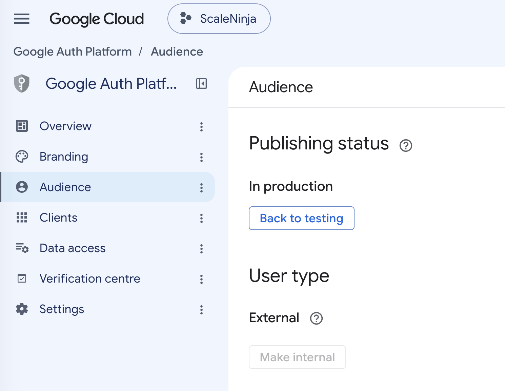

> **Google Workspace accounts:** if the project belongs to a Workspace organisation, the
> **Make internal** button is enabled. Internal apps skip Testing entirely, never show the
> unverified warning, and tokens don't expire. Only users in your organisation can sign in.

## 4. (Optional) Declare the Drive scope

`dsync` requests the `https://www.googleapis.com/auth/drive` scope at sign-in whether or not you
declare it here, so this step is optional for a personal app. Declaring it just makes the consent
screen list what the app can do. If you want to: **Data access → Add or remove scopes**, filter for
*Google Drive API*, tick `.../auth/drive`, click **Update**, then **Save**.

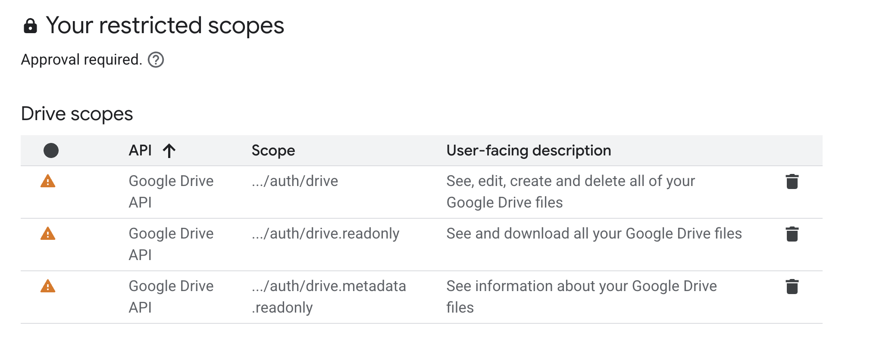

Google flags Drive scopes as *restricted* and says approval is required. That only applies to
publishing for the general public; for your own use the sign-in screens in step 6 let you through.

## 5. Create the OAuth client and download its JSON

Open **Clients** and click **Create client**. Set **Application type** to **Desktop app**, give it a
name (this one is only shown in the console), and click **Create**.

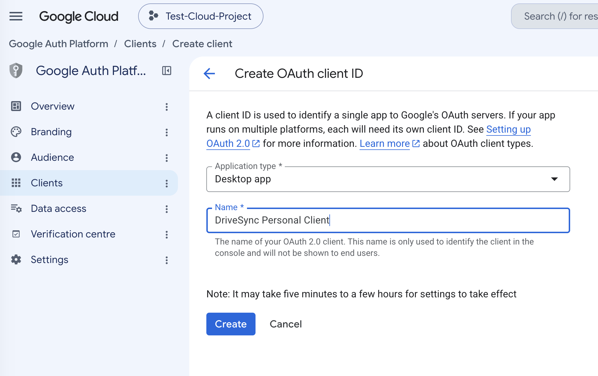

A dialog shows the client ID and secret. Click **Download JSON** and save the file somewhere handy,
e.g. `~/Downloads/client_secret.json`. You can download it again later from the Clients list.

Google treats desktop-app client secrets as non-confidential, but the file still identifies your
project, so don't commit it to a repository.

## 6. Run `dsync init`

Pick the local folder and the Drive folder you want to keep in sync, then:

```bash
dsync init ~/gdrive --remote-folder backups/lab --credentials ~/Downloads/client_secret.json
```

`~/gdrive` is created if needed (on Windows use a path such as `%USERPROFILE%\gdrive`).
`backups/lab` is relative to *My Drive* and is created on Drive if it doesn't exist. The credentials JSON is read once and its client ID and secret are stored in
`~/gdrive/.gd/` with mode 0600, so you can delete the download afterwards.

A browser tab opens (the URL is also printed in case it doesn't). Choose the account you added as a
test user:

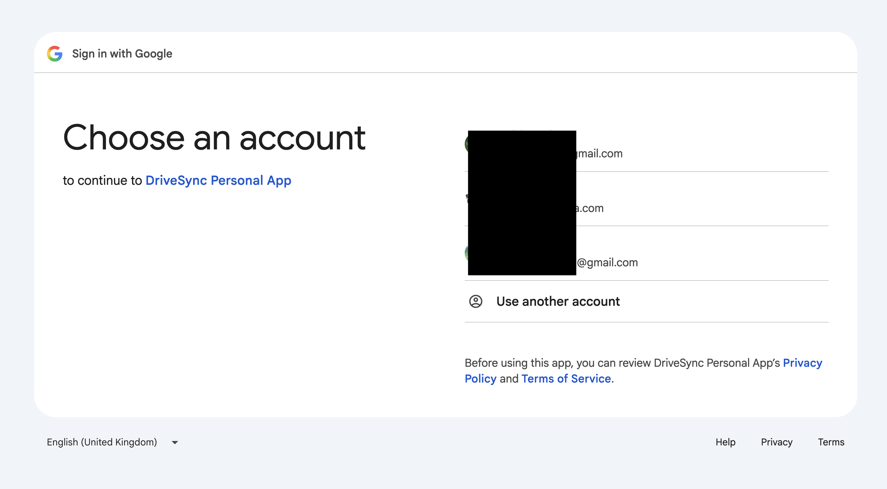

What comes next depends on the mode you chose in step 3.

### If the app is in Testing

Google notes that the app is being tested. Click **Continue**.

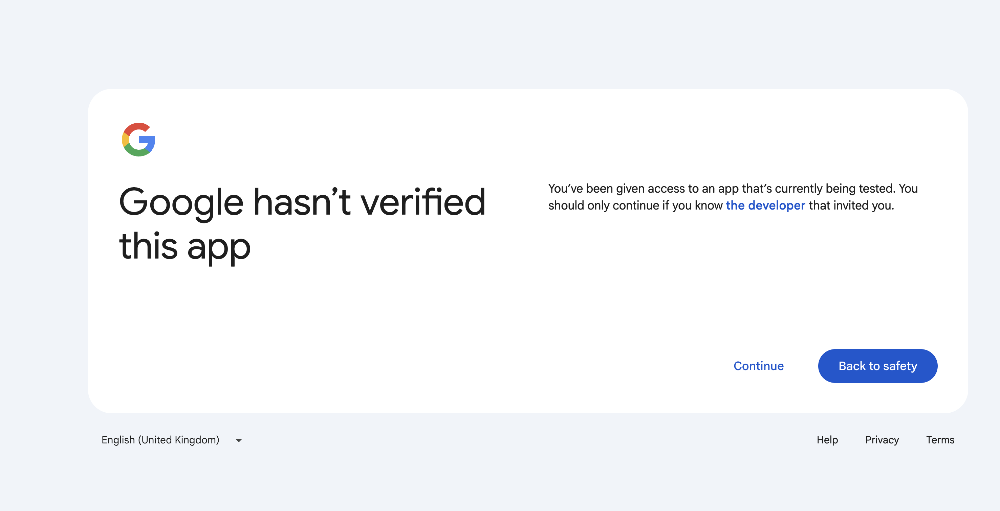

Then the consent screen. Click **Continue**.

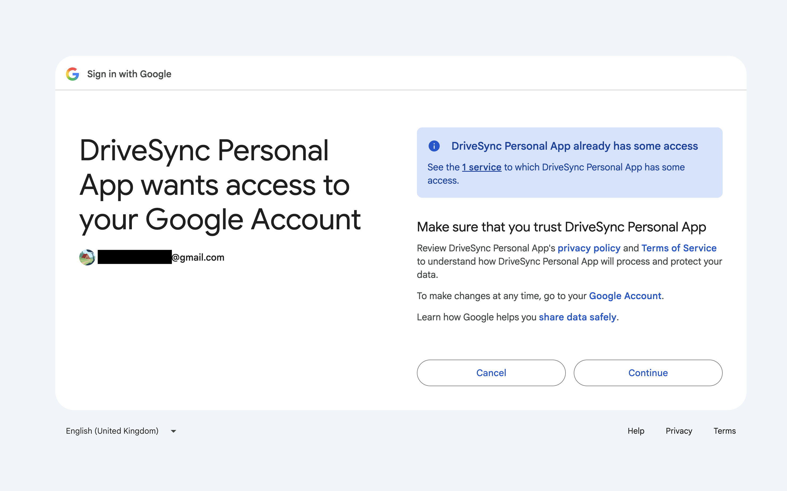

### If the app is published (in production, unverified)

Google shows a red warning because the app hasn't been through verification. Click **Advanced**,
then **Go to DriveSync Personal App (unsafe)**. The "unsafe" wording is Google's standard label for
any unverified app; this is your own client in your own project.

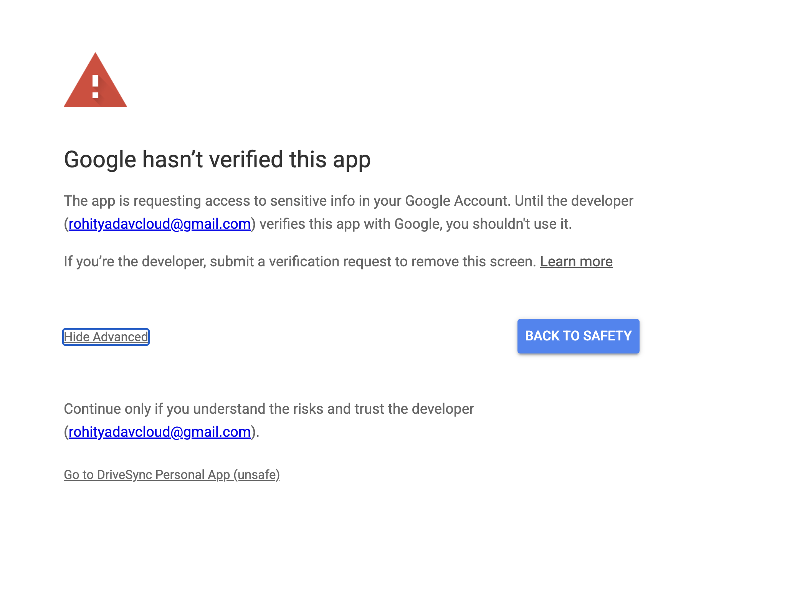

The consent screen lists the access being granted: *See, edit, create and delete all of your Google
Drive files*. That is the `auth/drive` scope. Google's wording describes what the scope permits,
not what the tool does: `dsync` never deletes anything unless you pass `--delete`, and even then
only after listing every deletion and asking. Click **Continue**.

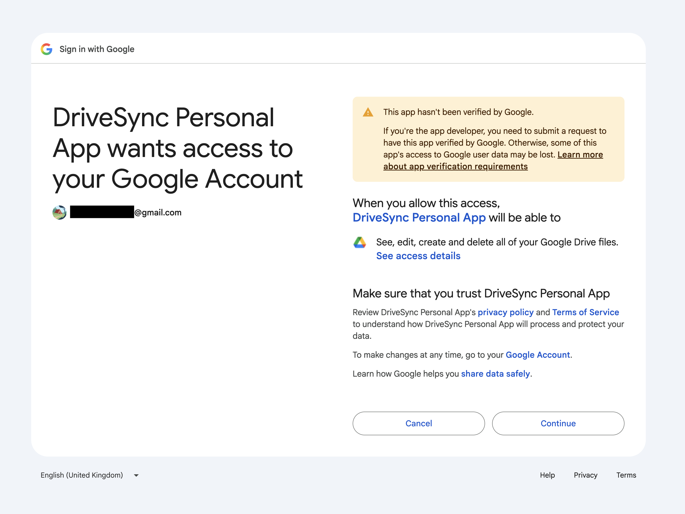

### Back in the terminal

The browser shows a short success message, `dsync` receives the code on a loopback port and stores
its tokens in `~/gdrive/.gd/` (mode 0600, never uploaded). Check it worked:

```bash
cd ~/gdrive
dsync status     # shows local/remote folders and token expiry
dsync diff       # lists what differs; nothing is changed
```

Then `dsync pull` or `dsync push` as needed. Both show the plan and ask before doing anything.

## Troubleshooting

- **"Access blocked: this app has not been verified" with no Advanced link.** The app is in Testing
  and the account you chose isn't a test user. Add it under **Audience → Test users**, or publish
  the app.
- **Asked to run `dsync init` again every week.** The app is still in Testing, so Google expires
  refresh tokens after 7 days. Click **Publish app** under Audience (step 3).
- **`Google did not return a refresh token`.** You've authorised this client before and Google only
  issues the refresh token once. Go to <https://myaccount.google.com/permissions>, remove the app,
  and run `dsync init` again.
- **`init` rejects the credentials file.** The JSON must be for a **Desktop app** client (its top-level
  key is `installed`). A *Web application* client (`web`) won't work; create a new client of the
  right type.
- **Revoking access.** Remove the app at <https://myaccount.google.com/permissions>, or delete the
  client in the Cloud Console. Either invalidates the tokens in `.gd/`.
